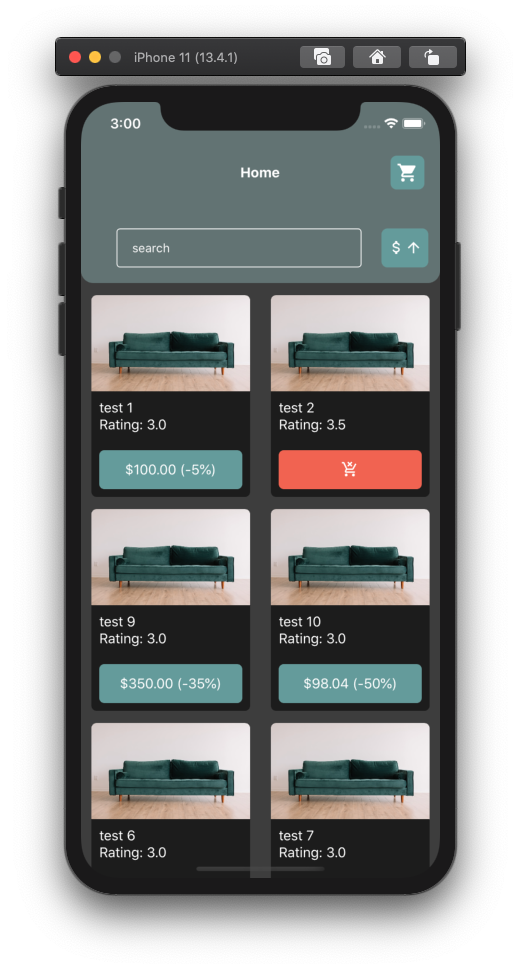
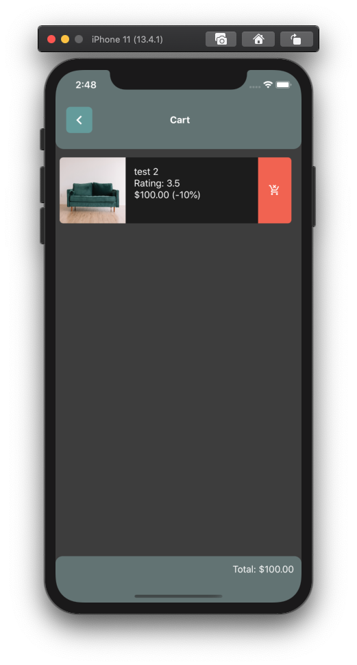
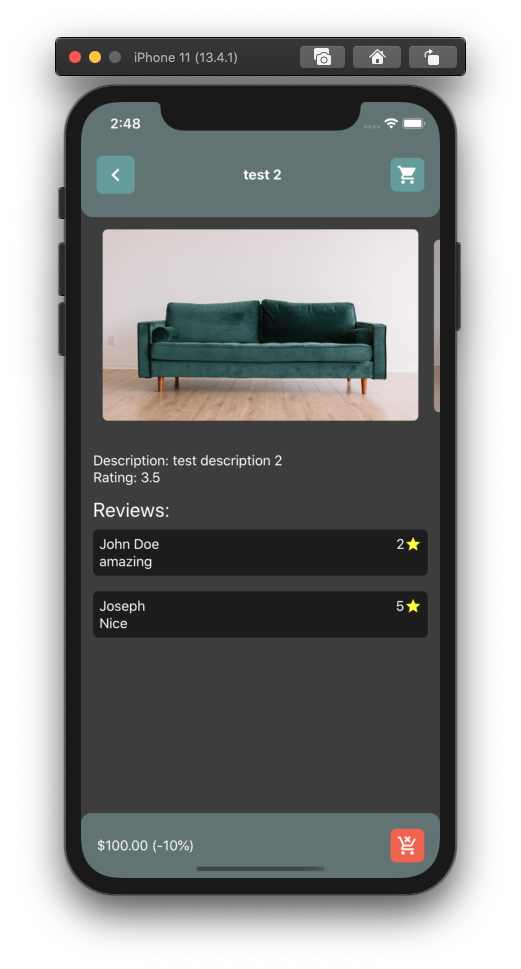

# App e-commerce

## Requirements

- node version 12+
- yarn or npm
- react-native-cli
- cocoaPods for iOS build
- android sdk for android build

## Commands

- `yarn && cd ios && pod install && cd ..`
- `yarn start`
- On another terminal use `yarn ios` or `yarn android`

## Structure

- Components (atomic design based)
- Screens
- Services (alot of functions separated by your use, example -> database)
- Routes
- Styles (static styles props(example -> colors))
- Constants (constants of app separated by entity or screen)
- Interfaces (most commons interfaces)

## ScreenShots

